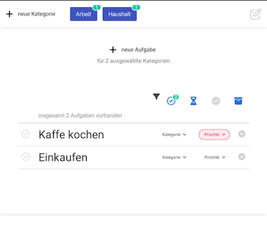

# little Browser Todo-App :)
Diese App läuft vollständig im Browser.
Alle Einträge, werden dauerhaft im LocaleStorage des Browsers gespeichert.

### *hier ausprobieren!*
* live Demo : [... netlify.app](https://63dd64b32e41a100637a10f6--sprightly-horse-c1f31f.netlify.app/)

### aktuelle Features
* Aufgaben anlegen, löschen, bearbeiten
* Kategorien anlegen, löschen, bearbeiten
* Aufgaben einer oder mehreren Kategorien zuordnen
* Aufgaben nach (offen, erledigt, laufend, archiviert) filtern
* Aufgaben Prioritäten (hoch, mittel, niedrig) setzen und ändern
* Export und Import aktuell über localStorage des Browser möglich
* Datenformat JSON
